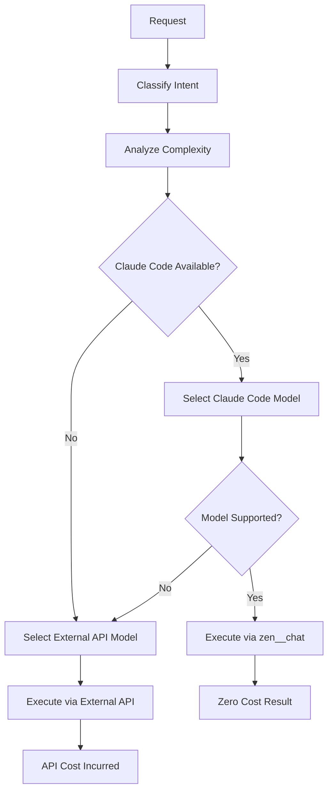

# Claude Code Integration Guide

## Overview

The Dynamic Orchestrator MCP Service now **prioritizes Claude Code's built-in models** over external API services, providing **zero-cost LLM operations** when used within Claude Code.

## Key Benefits

### 💰 Cost Savings
- **$0 API costs** when using Claude Code models
- Access to premium models (GPT-4, Gemini Pro, Claude Opus) at no additional cost
- Automatic fallback to external APIs only when necessary

### 🚀 Performance
- No network latency for model calls within Claude Code
- Faster response times for simple to moderate complexity tasks
- Seamless integration with existing orchestration logic

### 🔒 Security
- No API keys needed for Claude Code models
- Data stays within your Claude Code environment
- Reduced attack surface (no external API calls)

## How It Works

### 1. Model Priority System

```yaml
# config.yaml
use_claude_code: true  # Enable Claude Code priority
use_claude_code_first: true  # Try Claude Code before external APIs

claude_code_models:
  simple:
    - gemini-2.0-flash    # Fast, efficient
    - gemini-2.5-flash    
    - claude-3-5-haiku    # Claude's fastest model
  moderate:
    - gpt-4o-mini         # Balanced performance
    - gemini-2.5-pro      
    - claude-3-5-sonnet   
  complex:
    - gpt-4o              # Most capable
    - claude-opus-4       
    - o1-preview          # Advanced reasoning
```

### 2. Automatic Model Selection Flow



### 3. Integration Architecture

```python
# The system automatically detects and uses Claude Code when available
orchestrator = Orchestrator(config, mcp_session=claude_code_session)

# Priority order:
# 1. Claude Code models (if available and model supported)
# 2. External API models (fallback)
```

## Supported Models in Claude Code

### Via zen MCP tools:

| Model | Claude Code Alias | Use Case |
|-------|------------------|----------|
| Gemini 2.0 Flash | `gemini-2.0-flash` | Fast responses, simple tasks |
| Gemini 2.5 Flash | `gemini-2.5-flash` | Ultra-fast analysis |
| Gemini 2.5 Pro | `gemini-2.5-pro` | Complex reasoning |
| GPT-4o Mini | `mini` or `o4-mini` | Balanced performance |
| GPT-4o | `openai/o3` | Advanced capabilities |
| Claude 3.5 Haiku | `anthropic/claude-3.5-haiku` | Fast Claude model |
| Claude 3.5 Sonnet | `anthropic/claude-sonnet-4` | Balanced Claude |
| Claude Opus 4 | `anthropic/claude-opus-4` | Most capable Claude |

## Usage Examples

### Example 1: Simple Request (Uses Claude Code)
```python
# Request: "What files are in the src directory?"
# Complexity: Simple
# Selected Model: gemini-2.0-flash (via Claude Code)
# Cost: $0.00
```

### Example 2: Moderate Request (Uses Claude Code)
```python
# Request: "Search and summarize all Python files with async functions"
# Complexity: Moderate  
# Selected Model: gpt-4o-mini (via Claude Code)
# Cost: $0.00
```

### Example 3: Complex Request (Uses Claude Code)
```python
# Request: "Analyze the architecture and suggest scalability improvements"
# Complexity: Complex
# Selected Model: gpt-4o (via Claude Code)
# Cost: $0.00
```

## Configuration

### Enable Claude Code Priority

```yaml
# config.yaml
use_claude_code: true  # Must be true
use_claude_code_first: true  # Prioritize Claude Code

# Map complexity levels to Claude Code models
claude_code_models:
  simple: [gemini-2.0-flash, claude-3-5-haiku]
  moderate: [gpt-4o-mini, gemini-2.5-pro]
  complex: [gpt-4o, claude-opus-4]
```

### Disable Claude Code (Use External APIs)

```yaml
use_claude_code: false  # Disable Claude Code
# Or simply don't pass mcp_session to Orchestrator
```

## Cost Comparison

| Task Complexity | Without Claude Code | With Claude Code | Savings |
|----------------|-------------------|------------------|---------|
| Simple (500 tokens) | $0.001 | $0.00 | 100% |
| Moderate (2000 tokens) | $0.01 | $0.00 | 100% |
| Complex (5000 tokens) | $0.05 | $0.00 | 100% |
| **Monthly (1000 requests)** | **~$20** | **$0.00** | **100%** |

## Implementation Details

### ClaudeCodeLLMClient
Located in `src/utils/claude_code_client.py`, this client:
- Wraps Claude Code's zen MCP tools
- Maps external model names to Claude Code equivalents
- Provides zero-cost LLM operations

### Integration Points
1. **Intent Classification**: Uses `gemini-2.0-flash` via Claude Code
2. **Complexity Analysis**: Uses `gemini-2.0-flash` via Claude Code  
3. **Prompt Generation**: Uses `gpt-4o-mini` via Claude Code
4. **Execution**: Uses complexity-appropriate models via Claude Code

### Fallback Mechanism
If Claude Code is unavailable or a model isn't supported:
1. Automatically falls back to external APIs
2. Uses the configured API keys (OpenAI, Anthropic, Google)
3. Incurs standard API costs

## Testing

Run the integration test:
```bash
cd /Users/kediasu/Documents/dynamic-system/dynamic-orchestrator-mcp
python tests/test_claude_code_integration.py
```

This will:
- Compare costs with/without Claude Code
- Verify model priority selection
- Test the complete orchestration flow

## Troubleshooting

### Claude Code models not being used?
1. Check `use_claude_code: true` in config.yaml
2. Ensure `mcp_session` is passed to Orchestrator
3. Verify model is in `claude_code_models` configuration

### Fallback to external APIs?
- This is normal if Claude Code doesn't support the requested model
- Check logs for "Using Claude Code for model..." messages
- Verify Claude Code zen tools are accessible

### Performance considerations
- Claude Code models run locally, so complex tasks may take longer
- For time-critical operations, consider using external APIs
- Balance cost savings vs. performance requirements

## Best Practices

1. **Default to Claude Code**: Keep `use_claude_code: true` for cost savings
2. **Model Selection**: Configure appropriate models for each complexity level
3. **Monitoring**: Track which provider (Claude Code vs. External) is being used
4. **Testing**: Regularly test both paths to ensure fallback works
5. **Documentation**: Document any custom model mappings or configurations

## Future Enhancements

- [ ] Add more Claude Code model mappings
- [ ] Implement smart caching for Claude Code responses
- [ ] Add metrics tracking for Claude Code vs. external usage
- [ ] Support for streaming responses via Claude Code
- [ ] Dynamic model selection based on load and availability

## Summary

The Claude Code integration provides **significant cost savings** while maintaining **full functionality**. With zero API costs and automatic fallback mechanisms, it's the ideal solution for development and testing, with the flexibility to use external APIs when needed for production workloads.